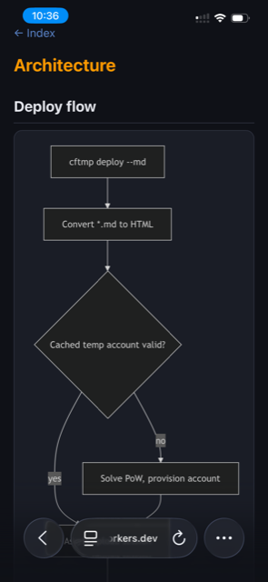
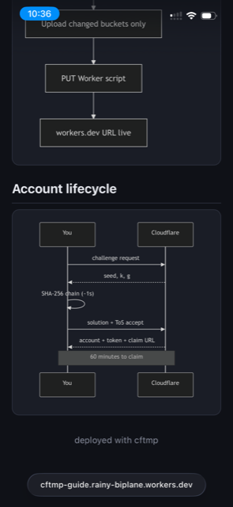
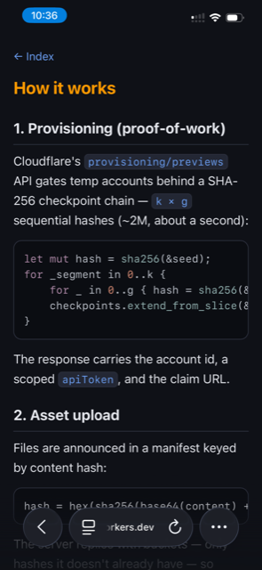
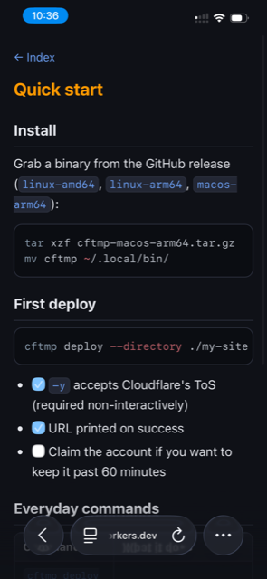

# cfdrop

Deploy a directory to a **temporary Cloudflare account** — no signup, no wrangler, no Node — and get a live `workers.dev` URL for browsing. Self-contained Rust CLI.

```
cfdrop deploy --directory path/to/dir/
```

```
Found 15 file(s), 42.3 KiB total.
Provisioning temporary Cloudflare account...
Solving proof-of-work (2000000 SHA-256 hashes)...
Temporary account Waiting Salmonberry (created), expires 23:41 UTC

✅ Deployed: https://my-site.waiting-salmonberry.workers.dev

This temporary account expires in ~58 minutes.
Keep it by claiming: https://dash.cloudflare.com/claim-preview?claimToken=...
```

## How it works

Implements Cloudflare's [claim-deployments (temporary accounts)](https://developers.cloudflare.com/workers/platform/claim-deployments/) provisioning API and the [static assets direct upload](https://developers.cloudflare.com/workers/static-assets/direct-upload/) protocol natively:

1. `POST /provisioning/previews/challenge` → proof-of-work challenge
2. Solve the SHA-256 checkpoint chain locally (`k × g` sequential hashes, ~1s)
3. `POST /provisioning/previews` (ToS acceptance) → temp account id + API token + claim URL
4. `POST .../assets-upload-session` with a content-hash manifest → upload JWT + buckets
5. `POST .../workers/assets/upload?base64=true` per bucket → completion JWT
6. `PUT .../workers/scripts/{name}` (assets-only Worker) + enable `workers.dev` → live URL

The temporary account is cached in the OS config dir (`~/Library/Application Support/cfdrop/state.json` on macOS, mode 0600) and reused across deploys until it expires — same behavior as `wrangler deploy --temporary`.

## Commands

| Command | Description |
|---------|-------------|
| `cfdrop deploy -d <dir> [-n name] [-y] [--fresh] [--auth user:pass] [--md]` | Bundle and deploy a directory |
| `cfdrop status` | Show cached temp account, claim URL, expiry |
| `cfdrop logout` | Forget the cached temp account |

- `-y` accepts Cloudflare's Terms of Service / Privacy Policy without prompting (required for non-interactive use)
- `--fresh` forces provisioning a new account even if a cached one is still valid
- `--auth user:pass` protects the site with HTTP Basic Auth: deploys a small guard Worker in front of the assets (`run_worker_first`) that returns 401 unless the browser sends the matching credential. Note the credential is baked into the Worker script — fine for a 60-minute preview, not a real security boundary. For long-lived sites, claim the account and use [Cloudflare Access](https://developers.cloudflare.com/cloudflare-one/policies/access/) instead (not available on temporary accounts).
- `--md` treats the directory as Markdown: every `*.md` is converted (pulldown-cmark: tables, strikethrough, footnotes, task lists) into a dark-theme, mobile-first HTML page — vertical scrolling only, wide tables scroll inside their own block. Non-markdown files are copied through. Unless an `index.md`/`index.html` exists, an index page listing all pages as tappable cards is generated. Titles come from the first `# heading`.
- Worker name defaults to the sanitized directory name

## `--md` on a phone

Four `.md` files, one deploy — mermaid diagrams, syntax-highlighted code, task lists (source: [`examples/md-sample/`](examples/md-sample/)):

| Mermaid `graph TD` | Mermaid `sequenceDiagram` | Syntax highlighting | Tables & task lists |
|---|---|---|---|
|  |  |  |  |

## Notes & limits

- Temporary accounts last **60 minutes** unless claimed via the printed claim URL; unclaimed accounts and their deployments auto-delete
- Asset limits on temp accounts: ≤ 1,000 files, ≤ 5 MiB per file
- Hidden files/dirs (`.git`, `.DS_Store`, ...) are skipped
- The claim URL is a **bearer credential** — anyone holding it can claim the account. The state file is written with mode 0600; don't share it
- Asset hash scheme (must match the server): `hex(sha256(base64(content) + extension))[..32]`
- The Cloudflare API returns `"errors": null` / `"buckets": null` (explicit nulls) — the envelope types tolerate this

## Build

```
cargo test
cargo build --release
```

Single static-ish binary (rustls, no OpenSSL dependency).

## Example

`examples/gen-triage-site.py` fetches all open issues from `openabdev/openab` via the `gh` CLI and generates a mobile-first static site (index tiles + per-issue detail pages with summary, current-vs-expected flow diagram, root-cause analysis, and a suggested triage response), then:

```
python3 examples/gen-triage-site.py
cfdrop deploy --directory /tmp/openab-issues-site --name openab-issues -y
```

Detail-page analysis sections are read from `/tmp/openab-analysis/<number>.json` when present (e.g. produced by an AI agent pass over the issues); pages render fine without them. Point it at another repo by editing `REPO` at the top of the script.
