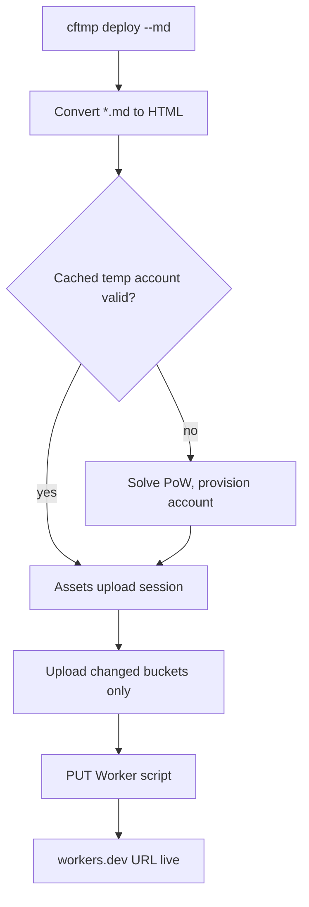
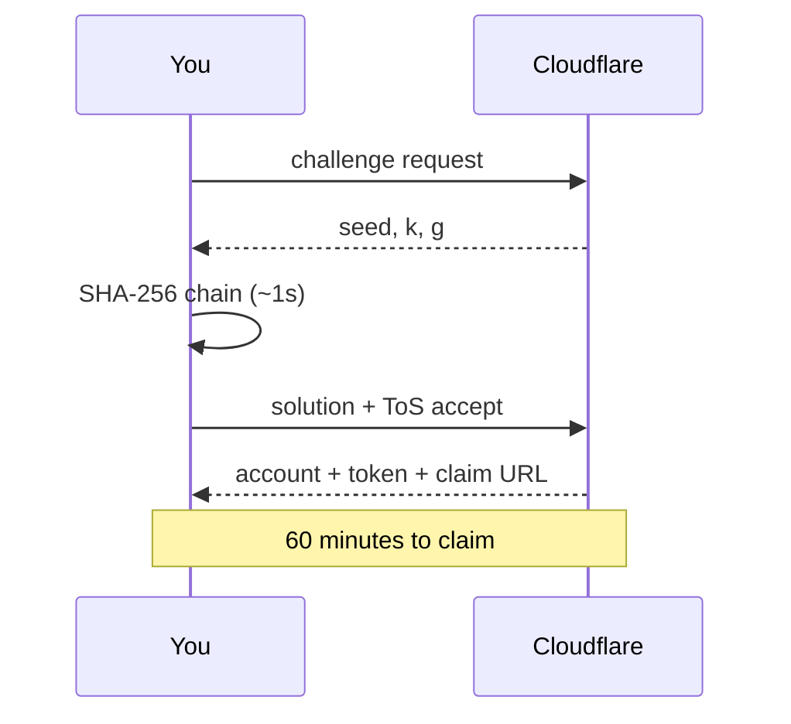

# Architecture

## Deploy flow

```mermaid
graph TD
  A[cftmp deploy --md] --> B[Convert *.md to HTML]
  B --> C{Cached temp account valid?}
  C -- yes --> E[Assets upload session]
  C -- no --> D[Solve PoW, provision account]
  D --> E
  E --> F[Upload changed buckets only]
  F --> G[PUT Worker script]
  G --> H[workers.dev URL live]
```

## Account lifecycle

```mermaid
sequenceDiagram
  participant U as You
  participant CF as Cloudflare
  U->>CF: challenge request
  CF-->>U: seed, k, g
  U->>U: SHA-256 chain (~1s)
  U->>CF: solution + ToS accept
  CF-->>U: account + token + claim URL
  Note over U,CF: 60 minutes to claim
```
